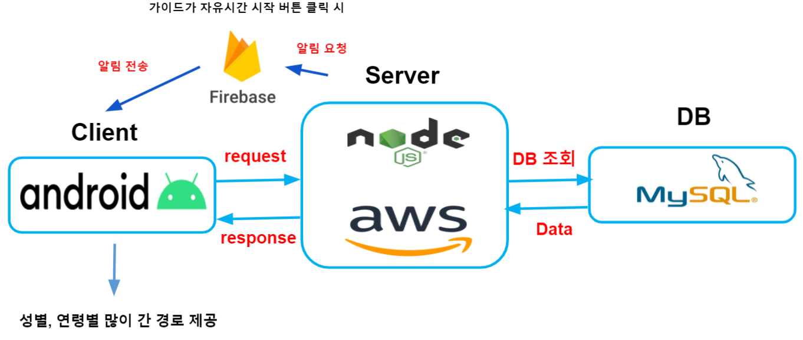
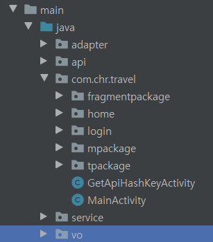

# Travel_Guide_Client
demo video : 

## 소개
패키지 여행
여행지인 낯선 지역에서 여행객들이 알찬 자유시간을 보낼 수 있도록 도와주고, 가이드에게 여행객들의 길 잃음 방지를 위한 실시간 위치를 제공하는 어플

## 기능
- 회원가입 시 가이드 버전과 여행객 버전 선택(서로 다른 화면 구성)
- 패키지 상품 가이드 간 공유
- 그룹 여행객 실시간 위치 파악
- 자유시간이 있는 장소에서 여행객들 성별, 나이별로 이동 경로 추천(여행객이 사용)
- 패키지 여행을 계획하는데 가이드에게 도움을 주기 위한 분석용 웹 제공(가이드가 사용)

## 개발 환경
- node.js (웹 서버)
- Android 스튜디오

## 애플리케이션 버전
- minSdkVersion : 16
- targetSdkVersion : 30

## 프로젝트 구조
  

Android

## 서비스 시연

## Server Node.js
[Travel_Guide_Server](https://github.com/nayeonkiim/Travel_Guide_server)

